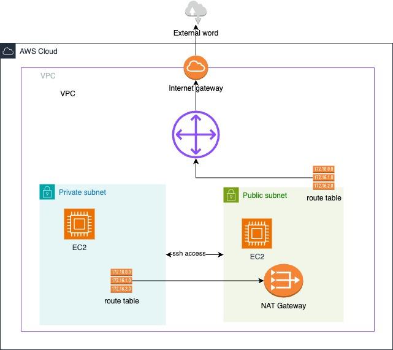

# Networking

## Watch these videos
- [AWS Networking Basics For Programmers | Hands On](https://www.youtube.com/watch?v=2doSoMN2xvI)

## Setup 2 EC2 Instances (Private and Public)

1. **Create a VPC** with CIDR `10.0.0.0/16`.
2. Create a **public subnet** with CIDR `10.0.0.0/24` and a **private subnet** with CIDR `10.0.1.0/24`.
3. Launch an **EC2 instance** in the public subnet and VPC with **auto-assign public IP**. Use a security group with a rule to SSH from anywhere and add the keypair to SSH into the instance with `ec2-user`.
4. At this time, if we try to SSH into the instance, we will not be able to do it. We need an **Internet Gateway**. A subnet named as public does not mean it is exposed to the public. The gateway allows VPC to access the Internet.
5. Attach an **Internet Gateway** to the VPC. Still, we will not be able to access the instance.
6. We need to give the public subnet a **route table** and a route to the Internet Gateway. Also, add a route table to the private subnet. Route tables belong to a subnet, so we will associate subnets to their proper route table.
7. Edit the route inside the public route table and add `0.0.0.0/0` so everyone will talk to each other, and the target will be the Internet Gateway.
8. Now, if we check, we will have an SSH connection to the public instance.
9. Create a **private instance** with the same VPC and private subnet with no auto-assign IP. Use a new security group and add the keypair to SSH.
10. Let's SSH into the private instance. We can't do that directly. We can SSH into the private instance from the public instance as they are in the same VPC, so they are all accessible from one to another. Copy the private key into the public instance, and now we can SSH into the private instance with `ec2-user` from the public instance.
11. But we will not be able to talk to the internet from the private instance, like doing `ping google.com` or `yum update -y`.
12. If there is a way so that none will talk to the private EC2 instance, but the private EC2 instance can talk to the internet, we could use a **NAT Gateway** here.
13. Create a **NAT Gateway** in the public subnet as this subnet has access to the internet.
14. Use the private route table to use the NAT Gateway to access the internet. We need an **Elastic IP** in the NAT Gateway.
15. Add a route in the private route table `0.0.0.0/0` and point to the NAT Gateway.
16. Now we will be able to access the internet from the private instance and also update the packages.

### NACL: Network Access Control List
A virtual firewall on the subnet. It is **stateless**, so if you allow something to the subnet, that does not mean it will allow traffic out from the subnet. We also need an outbound rule. The security group, which is a firewall to the EC2 instance, is **stateful**. So if you allow something in, it will also allow automatically back.