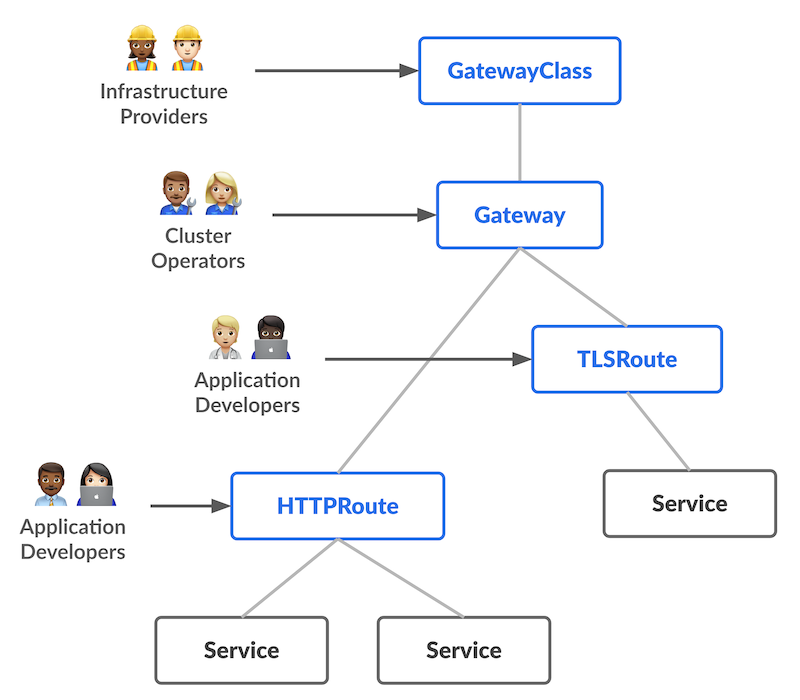

# Gateway API

## Medium
- [Gateway API vs Ingress in Kubernetes: A Deep Dive with Architecture Diagrams-Part1](https://medium.com/@shahebazsayed07/gateway-api-vs-ingress-in-kubernetes-a-deep-dive-with-architecture-diagrams-part1-9e6c88086c21)
- [Why do I need an API Gateway on a Kubernetes cluster](https://medium.com/@martin.hodges/why-do-i-need-an-api-gateway-on-a-kubernetes-cluster-c70f15da836c)


## Youtube
- [Mastering Kubernetes: Service and Network APIs (Service, Ingress, GatewayAPI)](https://www.youtube.com/watch?v=-1H0BeN9hIk)
- [GATEWAY API - Ingress is DEAD! Long live Ingress](https://www.youtube.com/watch?v=5D4Eh5XBLxU)
- [Gateway API Explained: The Future of Kubernetes Networking](https://www.youtube.com/watch?v=xaZ87iSvMAI)


## Refferences
- [Gateway API documentation](https://gateway-api.sigs.k8s.io/)
- [From kubernetes documentation](https://kubernetes.io/docs/concepts/services-networking/gateway/)
- [From google cloud](https://cloud.google.com/kubernetes-engine/docs/concepts/gateway-api)
- [Gateway API v1.2: WebSockets, Timeouts, Retries, and More](https://kubernetes.io/blog/2024/11/21/gateway-api-v1-2/)


## Implementations
- [Implementations](https://gateway-api.sigs.k8s.io/implementations/)
- [Envoy Gateway](https://gateway.envoyproxy.io/docs/tasks/quickstart/)
- [nginx](https://docs.nginx.com/nginx-gateway-fabric/installation/installing-ngf/manifests/)


## Installation

```bash
# Use nginx instead of envoy, as it is giving me error
# but later check the issue
# Use minikube tunnel for exposing the service because in a minikube setup we don't have loadbalancer like Metallb

# Gateway API related CRDs
kubectl apply -f https://github.com/kubernetes-sigs/gateway-api/releases/latest/download/standard-install.yaml

# Deploy the NGINX Gateway Fabric CRDs
kubectl apply -f https://raw.githubusercontent.com/nginx/nginx-gateway-fabric/v1.6.2/deploy/crds.yaml

# Deploy NGINX Gateway Fabric
kubectl apply -f https://raw.githubusercontent.com/nginx/nginx-gateway-fabric/v1.6.2/deploy/default/deploy.yaml

# Verify the Deployment
kubectl get pods -n nginx-gateway

# Use minikube tunnel to expose and add the hostname into your /etc/hosts
minukube tunnel
```


## Premise

To be generally available, web applications running on Kubernetes need to be exposed outside the cluster. This can be achieved in several ways. The simplest method to expose a service or API endpoint outside a Kubernetes cluster is to assign a service type of NodePort. The drawback of this approach is that the service runs on a non-standard port number. Additionally, each cluster has a limited number of ports assigned to its NodePort pool. These limitations can be overcome by using either the Ingress API or the Gateway API. While the Ingress API has been widely adopted in the Kubernetes world, it has its own drawbacks. Notably, a strong reliance on annotations in Ingress manifests makes the Ingress API inflexible and difficult to write generic templates for in Helm charts. The Gateway API overcomes these drawbacks by providing a generic, easy-to-templatize, and extensible way to define resources that provide an ingress of traffic to Kubernetes-hosted endpoints. In the following sections, we will compare the two approaches.

## Ingress API

HTTP and HTTPS network services can be exposed outside the Kubernetes cluster using Ingress resources, provided as part of the Ingress API. Traffic is routed using rules defined within the Ingress resource. Before Ingress resources can be defined, the cluster must have at least one Ingress Controller running. This Ingress Controller service is typically exposed using a LoadBalancer service type.

The Ingress API is widely adopted by Kubernetes users and well-supported by vendors with many implementations (Ingress controllers) available.

Ingress API resource organization


## Limitations of the Ingress API

- **Limited features**: The Ingress API only supports TLS termination and simple content-based request routing of HTTP traffic.
- **Reliance on annotations for extensibility**: The annotations approach to extensibility leads to limited portability as every implementation has its own supported extensions that may not translate to any other implementation.
- **Insufficient permission model**: The Ingress API is not well-suited for multi-team clusters with shared load-balancing infrastructure.

## Gateway API

The Gateway API is an official Kubernetes project being worked on by the Kubernetes Network SIG, representing the next generation of Ingress, Load balancing, and Service Mesh APIs. It focuses on L4 and L7 routing within Kubernetes. It has been designed from the outset to be generic, expressive, and role-oriented.

## Features of the Gateway API

The following design goals drive the concepts of Gateway API. These demonstrate how Gateway aims to improve upon current standards like Ingress.

- **Role-oriented**: Gateway is composed of API resources that model organizational roles that use and configure Kubernetes service networking.
- **Portable**: This isn't an improvement but rather something that should stay the same. Just as Ingress is a universal specification with numerous implementations, Gateway API is designed to be a portable specification supported by many implementations.
- **Expressive**: Gateway API resources support core functionality for things like header-based matching, traffic weighting, and other capabilities that were only possible in Ingress through custom annotations.
- **Extensible**: Gateway API allows for custom resources to be linked at various layers of the API. This makes granular customization possible at the appropriate places within the API structure.

## Gateway API Resource Model

**GatewayClass** - GatewayClass is a cluster-scoped resource that defines a set of Gateways that share a common configuration and behavior. A cluster needs to have at least one GatewayClass, which is handled by a Gateway Controller, similar to an Ingress Controller. A Gateway Controller may handle more than one GatewayClass.

**Gateway** - A Gateway describes how traffic can be translated within a cluster. As is evident from the name, it acts as a gateway between traffic outside the cluster and traffic within the cluster.

**Route Resources** define protocol-specific rules for mapping requests from a Gateway to Kubernetes Services. Route resources included in the API currently are:
- **HTTPRoute** - Used for multiplexing HTTP or terminated HTTPS connections.
- **GRPCRoute** - Used for idiomatically routing gRPC traffic.
- **TLSRoute (experimental)** - Used for multiplexing TLS connections, discriminated via SNI.
- **TCPRoute and UDPRoute (experimental)** - used for mapping one or more TCP or UDP ports to a single backend. These may be used to terminate TLS, where appropriate.


