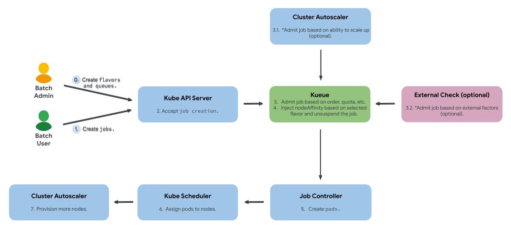

# Kueue

## Refferences
- [Documentation](https://kueue.sigs.k8s.io/docs/)
- [kubernetes-sigs/kueue](https://github.com/kubernetes-sigs/kueue)


## Why Kueue?
Kueue is a kubernetes-native system that manages quotas and how jobs consume them. Kueue decides when a job should wait, when a job should be admitted to start (as in pods can be created) and when a job should be preempted (as in active pods should be deleted).


## Why use Kueue

Kueue can be installed on a vanilla Kubernetes cluster without replacing any existing Kubernetes components. It is compatible with cloud environments where:

- Compute resources are elastic and can be scaled up and down.
- Compute resources are heterogeneous (in architecture, availability, price, etc.).

Kueue APIs allow you to define:

- Quotas and policies for fair sharing among tenants.
- Resource fungibility: if a resource flavor is fully utilized, Kueue can admit the job using a different flavor.

A core design principle for Kueue is to avoid duplicating mature functionality in Kubernetes components and well-established third-party controllers. Autoscaling, pod-to-node scheduling, and job lifecycle management are the responsibility of cluster-autoscaler, kube-scheduler, and kube-controller-manager, respectively. Advanced admission control can be delegated to controllers such as gatekeeper.


## Features overview

- Job management: Support job queueing based on priorities with different strategies: StrictFIFO and BestEffortFIFO.
- Advanced Resource management: Comprising resource flavor fungibility, fair sharing, cohorts, and preemption with a variety of policies between different tenants.
- Integrations: Built-in support for popular jobs, e.g., BatchJob, Kubeflow training jobs, RayJob, RayCluster, JobSet, AppWrappers, plain Pod, and Pod Groups.
- System insight: Built-in Prometheus metrics to help monitor the state of the system, and on-demand visibility endpoint for monitoring of pending workloads.
- AdmissionChecks: A mechanism for internal or external components to influence whether a workload can be admitted.
- Advanced autoscaling support: Integration with cluster-autoscaler's provisioningRequest via admissionChecks.
- All-or-nothing with ready Pods: A timeout-based implementation of All-or-nothing scheduling.
- Partial admission and dynamic reclaim: mechanisms to run a job with reduced parallelism, based on available quota, and to release the quota when the pods complete.
- Mixing training and inference: Simultaneous management of batch workloads along with serving workloads (such as Deployments or StatefulSets).
- Multi-cluster job dispatching: called MultiKueue, allows searching for capacity and off-loading the main cluster.
- Topology-Aware Scheduling: Allows optimizing the pod-pod communication throughput by scheduling aware of the data-center topology.

## High-level Kueue operation



## Concepts

### Resource Flavor 

> **Note**: [For further reference](https://kueue.sigs.k8s.io/docs/concepts/resource_flavor/)

A ResourceFlavor is an object that represents these resource variations and allows you to associate them with cluster nodes through labels, taints, and tolerations. <br>
We created Resource Flavors for interactive jobs.

To associate a ResourceFlavor with nodes, the ResourceFlavor object specifies the .spec.nodeLabels that should match the labels on the target nodes. If using cluster autoscaler, it must be configured to add these labels when adding new nodes.

```yaml
apiVersion: kueue.x-k8s.io/v1beta1
kind: ResourceFlavor
metadata:
  name: "interactive-resource-flavor"
spec:
  nodeLabels:
    node-role.kubernetes.io/interactive-worker: "true"
```

### Cluster Queue

A ClusterQueue is a cluster-scoped object that governs a pool of resources such as pods, CPU, memory, and hardware accelerators. A ClusterQueue defines:

- The quotas for the Resources Flavors that the ClusterQueue manages, with usage limits and order of consumption.
- Fair sharing rules across the multiple ClusterQueues in the cluster.

We configured a single cluster queue for workloads using the `interactive-resource-flavor` Resource Flavor, assigning CPU, memory, and ephemeral storage. The configuration is as follows:

ClusterQueue for interactive jobs
```yaml
apiVersion: kueue.x-k8s.io/v1beta1
kind: ClusterQueue
metadata:
  name: "cluster-queue-interactive"
spec:
  ...
  cohort: "workload-queues"
  resourceGroups:
  - coveredResources: ["cpu", "memory", "ephemeral-storage"]
    flavors:
    - name: "interactive-resource-flavor"
      resources:
      - name: "cpu"
        nominalQuota: 6
      - name: "memory"
        nominalQuota: 6Gi
      - name: "ephemeral-storage"
        nominalQuota: 50Gi
```

### LocalQueue
A LocalQueue is a namespace object that groups closely related workloads that belong to a single namespace. A namespace is typically assigned to a tenant (team or user) of the organization. A LocalQueue points to one ClusterQueue from which resources are allocated to run its Workloads.

We created a LocalQueue for ClusterQueue `cluster-queue-interactive`.

LocalQueue for interactive and headless ClusterQueues
```yaml
apiVersion: kueue.x-k8s.io/v1beta1
kind: LocalQueue
metadata:
  namespace: "interactive-workload"
  name: "interactive-local-queue"
spec:
  clusterQueue: "cluster-queue-interactive"
---
apiVersion: kueue.x-k8s.io/v1beta1
kind: LocalQueue
metadata:
  namespace: "headless-workload"
  name: "headless-local-queue"
spec:
  clusterQueue: "cluster-queue-headless"
```

To deploy a job using Kueue, we need to associate jobs to the specific LocalQueue first. Update the job manifest with the queue name in the job metadata. When you launch the job, it will be assigned to the `interactive-local-queue` queue. You can check the number of admitted jobs in a LocalQueue with the following command.

`kubectl get localQueue -n <namespace>`

Jobs manifest with assigned queue name
```yaml
apiVersion: batch/v1
kind: Job
metadata:
  namespace: "interactive-workload"
  labels:
    ...
    kueue.x-k8s.io/queue-name: interactive-local-queue
  name: "jobname"
spec:
  parallelism: 1
  completions: 1
  ...
```

### WorkloadPriorityClass

A **WorkloadPriorityClass** allows you to control the `Workload's priority` without affecting the `pod's priority`. This feature is useful for these cases:

- Want to prioritize workloads that remain inactive for a specific duration.
- Want to set a lower priority for development workloads and higher priority for production workloads.

### Cohort

A Cohort is essentially a pool of ClusterQueues that can lend or borrow unused quota resources to each other. This setup helps in efficiently utilizing the cluster's resources, especially when some namespaces might have underutilized quotas while others could be running out.

When a ClusterQueue is part of a Cohort, Kueue tries to schedule workloads (jobs) onto the cluster resources managed by the ClusterQueues in the cohort. If a particular ClusterQueue doesn't have enough resources to accommodate a workload, it can "borrow" unused quota from other ClusterQueues within the same cohort.

This borrowing mechanism is subject to certain rules, such as the total requested resources fitting within the combined unused quota of the Cohort members plus a borrowing limit. This ensures fair usage and prevents over-allocation of resources.


## Deployment strategies Examples

We aimed to establish two ClusterQueues tailored to different job types: Headless and Interactive. Within the science platform, users can directly launch interactive jobs, whereas headless jobs must be initiated through API calls. Consequently, we configured the ClusterQueues to accommodate these distinctions—one queue dedicated to interactive jobs and another to headless jobs. This setup enables us to allocate resources appropriately to each job type and share resources between the queues as necessary. Additionally, we aimed to assign worker nodes in the Kubernetes cluster to specific ClusterQueues, ensuring that interactive and headless jobs run on their respective nodes.


### Single ClusterQueue with Workload Priority Class 

This strategy allows you to use a single cluster queue and prioritize specific jobs or types of jobs over other jobs using the workload priority class. This has an advantage of simplicity and different types of jobs or jobs scheduled by different groups can have different relative priorities and use the same shared resources assigned to the ClusterQueue. This is a suitable strategy for a small cluster with few resources. The disadvantage of this approach is that in a case where there is a high volume of jobs with higher priority, jobs with lower priorities may never get executed.

We configured the priority class for interactive workloads, based on headless and interactive jobs. Assign the priority class to the jobs with:

WorkloadPriorityClass for interactive jobs
```yaml
apiVersion: kueue.x-k8s.io/v1beta1
kind: WorkloadPriorityClass
metadata:
  name: interactive-jobs-priority
value: 10000
description: "Interactive jobs priority"
---
apiVersion: kueue.x-k8s.io/v1beta1
kind: WorkloadPriorityClass
metadata:
  name: headless-job-priority
value: 5000
description: "Headless jobs priority"
```

Jobs with interactive WorkloadPriorityClass
```yaml
apiVersion: batch/v1
kind: Job
metadata:
  namespace: "interactive-workload"
  labels:
    ...
    kueue.x-k8s.io/queue-name: interactive-local-queue
    kueue.x-k8s.io/priority-class: interactive-job-priority
  name: "jobname"
spec:
  parallelism: 1
  completions: 1
  ...
```

Given the assigned priorities, the scheduler will prioritize the interactive jobs first, and headless jobs may be preempted if resources are needed for interactive jobs.


### Multiple Cluster Queues with multiple resources

This strategy uses multiple cluster queues, each associated with their own independent resources. This strategy addresses the drawback of the single queue with workload priority classes by ensuring that jobs are not starved of resources. This approach also enables Kubernetes administrators to associate specific worker nodes with cluster queues. One such example of this would be to associate general purpose compute nodes with one queue while assigning worker nodes with GPUs to another queue. This approach can also lead to some worker nodes being under-utilized while observing 100% utilization on other nodes. We will see how this problem can be addressed using a "cohort", a feature in Kueue.

We created multiple ClusterQueues with different ResourceFlavors to segregate resource types across the cluster. We configured two ResourceFlavors based on job types (Interactive and Headless) and updated the ClusterQueues accordingly.

ResourceFlavors for interactive and headless jobs
```yaml
apiVersion: kueue.x-k8s.io/v1beta1
kind: ResourceFlavor
metadata:
  name: "interactive-resource-flavor"
---
apiVersion: kueue.x-k8s.io/v1beta1
kind: ResourceFlavor
metadata:
  name: "headless-resource-flavor"
```

Interactive and headless ClusterQueues with their respective ResourceFlavor
```yaml
apiVersion: kueue.x-k8s.io/v1beta1
kind: ClusterQueue
metadata:
  name: "cluster-queue-interactive"
spec:
  ...
  resourceGroups:
  - coveredResources: ["cpu", "memory", "ephemeral-storage"]
    flavors:
    - name: "interactive-resource-flavor"
     ...   
---
apiVersion: kueue.x-k8s.io/v1beta1
kind: ClusterQueue
metadata:
  name: "cluster-queue-headless"
spec:
  ...
  resourceGroups:
  - coveredResources: ["cpu", "memory", "ephemeral-storage"]
    flavors:
    - name: "headless-resource-flavor"
     ... 
```
Both ClusterQueues refer to different ResourceFlavors. Jobs on each queue will refer to the resources associated with the given ResourceFlavor.


### Sharing resources of ClusterQueue with cohort


When admitting a job, if the workload's requested resources exceed the resources available on a ClusterQueue, the job will remain in a "Suspended" state until currently running jobs have run to completion, thereby freeing up resources. However, when a ClusterQueue is part of a Cohort, Kueue will examine the list of ResourceFlavors associated with the ClusterQueue. For each ResourceFlavor, Kueue attempts to fit a workload's pod set within the quotas defined for each resource type within that ResourceFlavor. If it is unable to fit, Kueue will evaluate the next ResourceFlavor on the list.

We configured our ClusterQueues to share resources via a cohort by adding a common ResourceFlavor.

ResourceFlavor for Cohort
```yaml
apiVersion: kueue.x-k8s.io/v1beta1
kind: ResourceFlavor
metadata:
  name: "common-flavor"
```

Manifest for ClusterQueues with Cohort
```yaml

apiVersion: kueue.x-k8s.io/v1beta1
kind: ClusterQueue
metadata:
  name: "cluster-queue-interactive"
spec:
  ...
  cohort: "workload-queues"
  resourceGroups:
  - coveredResources: ["cpu", "memory", "ephemeral-storage"]
    flavors:
    - name: "common-flavor"
      resources:
      - name: "cpu"
        nominalQuota: 6
        borrowingLimit: 4
      - name: "memory"
        nominalQuota: 6Gi
    ...
---
apiVersion: kueue.x-k8s.io/v1beta1
kind: ClusterQueue
metadata:
  name: "cluster-queue-headless"
spec:
  ...
  cohort: "workload-queues"
  resourceGroups:
  - coveredResources: ["cpu", "memory", "ephemeral-storage"]
    flavors:
    - name: "common-flavor"
      resources:
      - name: "cpu"
        nominalQuota: 4
      - name: "memory"
        nominalQuota: 4Gi
        lendingLimit: 2Gi
      ...
```

With these configured ClusterQueues, when jobs on `cluster-queue-interactive` have occupied all resources, new jobs can run on `cluster-queue-headless`.

Within a cohort, Kueue prioritizes scheduling workloads that fit under the nominal quota. By default, if multiple workloads require borrowing, Kueue schedules higher priority workloads first. If the feature gate `PrioritySortingWithinCohort=false` is set, Kueue schedules workloads with the earliest `.metadata.creationTimestamp`.

You can set the borrowing limit and lending limit to control resource sharing. For example, `cluster-queue-interactive` can admit workloads using up to 10 CPUs (6 + 4 borrowing limit). `cluster-queue-headless` can lend up to 2Gi of memory, allowing `cluster-queue-interactive` to use up to 8Gi of memory (6Gi + 2Gi lending limit).


### Sharing resources with different ResourceFlavor

Next, we wanted to assign worker nodes to specific ClusterQueues in order to run the specific jobs on specific nodes. We assigned nodes with labels using the below command. With this, we assigned worker1, worker2, worker3 to interactive jobs and worker4, worker5 for the headless jobs.

Script to add labels to node
```sh
kubectl label nodes k8s-worker1 k8s-worker2 k8s-worker3 node-role.kubernetes.io/interactive-worker=true
kubectl label nodes k8s-worker4 k8s-worker5 node-role.kubernetes.io/headless-worker=true
```

We will add this label in the resource flavor, in order to associate them with nodes.

ResourceFlavors with node labels
```yaml
apiVersion: kueue.x-k8s.io/v1beta1
kind: ResourceFlavor
metadata:
  name: "interactive-resource-flavor"
spec:
  nodeLabels:
    node-role.kubernetes.io/interactive-worker: "true"
---
apiVersion: kueue.x-k8s.io/v1beta1
kind: ResourceFlavor
metadata:
  name: "headless-resource-flavor"
spec:
  nodeLabels:
    node-role.kubernetes.io/headless-worker: "true"
```

Jobs assigned to the interactive queue will launch on nodes labeled interactive-worker, and headless jobs on nodes labeled headless-worker. These two different ResourceFlavors won't work with a Cohort unless multiple ResourceFlavors are added to the resource groups.

Two ClusterQueues with two ResourceFlavors configured with Cohort
```yaml
apiVersion: kueue.x-k8s.io/v1beta1
kind: ClusterQueue
metadata:
  name: "cluster-queue-interactive"
spec:
  ...
  cohort: "workload-queues"
  resourceGroups:
  - coveredResources: ["cpu", "memory", "ephemeral-storage"]
    flavors:
    - name: "interactive-resource-flavor"
      resources:
      - name: "cpu"
        nominalQuota: 30
      - name: "memory"
        nominalQuota: 30Gi
      - name: "ephemeral-storage"
        nominalQuota: 300Gi
    - name: "headless-resource-flavor"
      resources:
      - name: "cpu"
        nominalQuota: 0
      - name: "memory"
        nominalQuota: 0Gi
      - name: "ephemeral-storage"
        nominalQuota: 0Gi
---
apiVersion: kueue.x-k8s.io/v1beta1
kind: ClusterQueue
metadata:
  name: "cluster-queue-headless"
spec:
  ...
  cohort: "workload-queues"
  resourceGroups:
  - coveredResources: ["cpu", "memory", "ephemeral-storage"]
    flavors:
    - name: "headless-resource-flavor"
      resources:
      - name: "cpu"
        nominalQuota: 4
      - name: "memory"
        nominalQuota: 4Gi
      - name: "ephemeral-storage"
        nominalQuota: 50Gi
```

Now that `headless-resource-flavor` is mentioned in the resource groups for `cluster-queue-interactive`, the nodes and resources assigned to `cluster-queue-headless` can be used by `cluster-queue-interactive`.